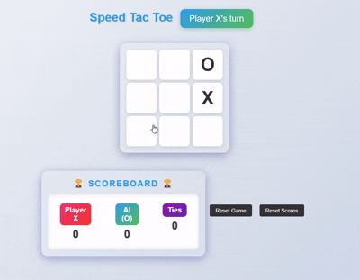

# Tic Tac Toe with AI (Minimax Algorithm)

This project is a **Tic Tac Toe game** with an AI opponent powered by the **Minimax algorithm**. It is built using **Flask** for the backend and can be integrated with a frontend for an interactive user experience.

---

## Features

1. **AI-Powered Gameplay**:
   - Implements the **Minimax algorithm** for the AI to make optimal moves.
   - Ensures challenging gameplay against the computer.

2. **RESTful API**:
   - Endpoints for making moves (`/move`), resetting the game (`/reset`), and retrieving the game state (`/state`).
   - Built using **Flask** with **CORS** enabled for cross-origin requests.

3. **Dynamic Game State Management**:
   - Tracks the game board, current turn, and winner in real-time.
   - Automatically switches turns between the player and AI.

4. **Error Handling**:
   - Validates move indices and prevents invalid or duplicate moves.
   - Returns meaningful error messages for invalid requests.

5. **Reset and Replay**:
   - Allows resetting the game to start fresh at any time.

6. **Scalable Backend**:
   - Designed to handle game logic efficiently with minimal server overhead.

---

## Gameplay Showcase

---

